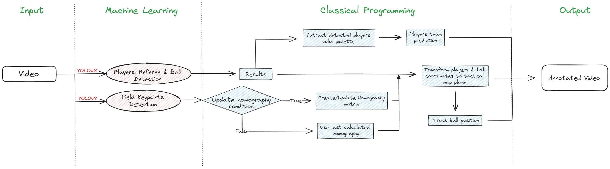
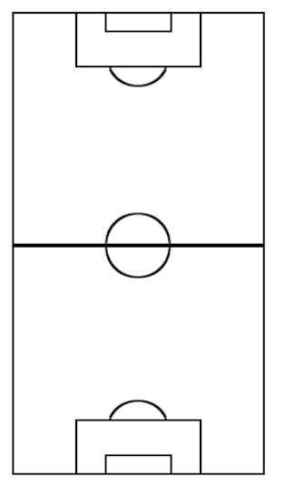
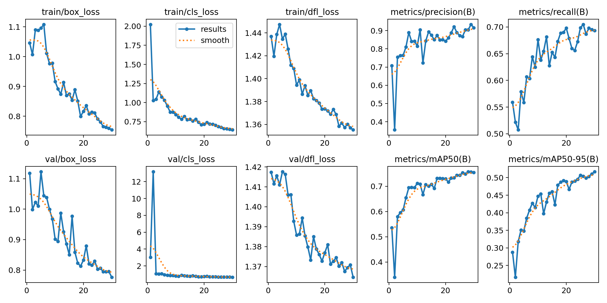
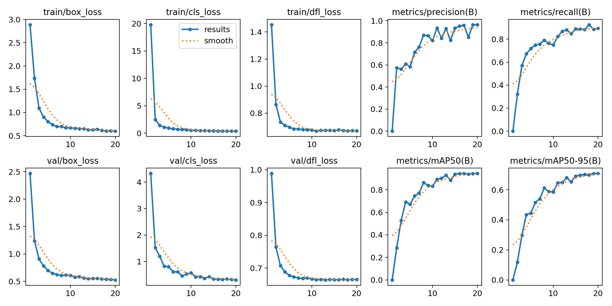
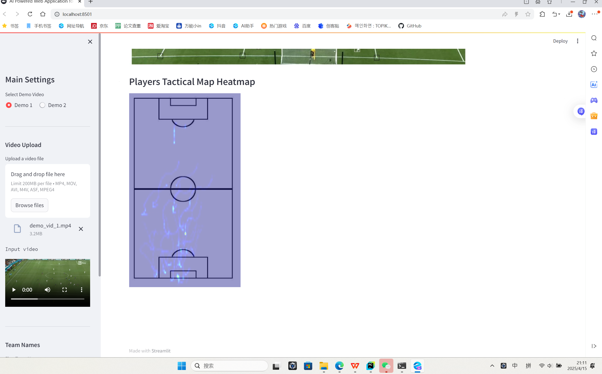

# Low-Cost Football Analytics

A low-cost football analytics project that uses deep learning and computer vision to extract useful insights from football match video. The repository focuses on making video-based football analysis more accessible with open-source Python tools such as PyTorch, Ultralytics, OpenCV, scikit-learn, and Streamlit.

## Overview

`low-cost-football-analytics` is intended for students, analysts, coaches, and football fans who want to experiment with practical football analytics without expensive tracking systems or commercial data subscriptions.

The current implementation is centered on tactical-camera footage and supports workflows such as:

- Detecting players, referees, and the ball
- Projecting detections onto a tactical map
- Predicting teams from jersey colors
- Visualizing ball tracks and player heatmaps
- Exploring simple interactive outputs with Streamlit

## Features

- Computer-vision based football video analysis
- Deep learning workflow using PyTorch and Ultralytics
- Video and image processing with OpenCV and Pillow
- Machine learning utilities with scikit-learn
- Streamlit support for interactive demos and dashboards
- Extensible structure for scouting, match review, and tactical analysis
- Experimental possession and passing statistics

## Demo Showcase

### 1. Application Home Page



### 2. Tactical Map Asset



### 3. Players Detection Training Results



### 4. Field Keypoints Training Results



### 5. Sample Streamlit Output



## Repository Layout

The main project code lives in:

`Football-Analytics-with-Deep-Learning-and-Computer-Vision-master/`

Key files:

- `Football-Analytics-with-Deep-Learning-and-Computer-Vision-master/Streamlit web app/main.py`: Streamlit app entry point
- `Football-Analytics-with-Deep-Learning-and-Computer-Vision-master/Streamlit web app/detection.py`: detection, tactical map, tracking, and statistics logic
- `Football-Analytics-with-Deep-Learning-and-Computer-Vision-master/models/`: trained YOLO model artifacts
- `Football-Analytics-with-Deep-Learning-and-Computer-Vision-master/Football Object Detection With Tactical Map.ipynb`: notebook prototype

## Getting Started

### Prerequisites

Recommended setup:

- Python 3.10 or newer
- Git
- A virtual environment
- A local football video file for testing

### Installation

Clone the repository:

```bash
git clone https://github.com/TIANjiming07/low-cost-football-analytics.git
cd low-cost-football-analytics
```

Move into the main project folder:

```bash
cd Football-Analytics-with-Deep-Learning-and-Computer-Vision-master
```

Create and activate a virtual environment:

```bash
python -m venv .venv
.venv\Scripts\activate
```

Install the dependencies:

```bash
pip install -r requirements.txt
```

> Note: The dependency file currently lists `python-opencv`. If installation fails, try installing `opencv-python` instead.

### Conda Option

If you prefer conda:

```bash
cd Football-Analytics-with-Deep-Learning-and-Computer-Vision-master
conda env create -f environment.yml
conda activate <your-env-name>
```

## Usage

A typical workflow is:

1. Add or reference a football match video.
2. Run the computer vision pipeline to detect and track objects.
3. Generate annotated video, metrics, or dashboard outputs.
4. Review the results and refine the analysis.

To run the current Streamlit app:

```bash
cd "Football-Analytics-with-Deep-Learning-and-Computer-Vision-master/Streamlit web app"
streamlit run main.py
```

If `streamlit` is not available in your shell, use:

```bash
python -m streamlit run main.py
```

The app is usually available at:

`http://localhost:8501`

## Potential Analysis Outputs

This project can be extended to support:

- Player detection and tracking
- Ball detection and tracking
- Team identification
- Speed and distance estimation
- Possession or phase-of-play analysis
- Annotated match clips
- Interactive dashboards for match review

## Data and Models

This repository may require video files, trained model weights, or other large assets that are not stored directly in GitHub. If you add those files, consider documenting:

- Where the data comes from
- How to download or prepare it
- Where model weights should be placed
- Any licensing or usage restrictions

Current model artifacts are stored under:

- `Football-Analytics-with-Deep-Learning-and-Computer-Vision-master/models/Yolo8L Players/`
- `Football-Analytics-with-Deep-Learning-and-Computer-Vision-master/models/Yolo8M Field Keypoints/`

## Limitations

- Designed for tactical-camera footage only
- Possession and passing statistics are currently heuristic and may drift when detections are unstable
- Team classification depends on accurate manual color selection
- Ball tracking is sensitive to missed detections and occlusion

## Roadmap

- Add the five final UI screenshots to replace the temporary showcase images
- Add clearer model weight setup instructions
- Include example commands for common analysis tasks
- Add troubleshooting notes for dependency installation
- Add tests or validation scripts for core analysis steps
- Improve player tracking and event extraction accuracy

## Contributing

Contributions are welcome. Helpful improvements include:

- Better setup instructions
- Bug fixes for dependencies or scripts
- Example videos or screenshots
- New analysis metrics
- Streamlit dashboard improvements
- Documentation for model weights and data sources

## License

No license has been specified yet. Add a license before distributing or reusing this project publicly.

