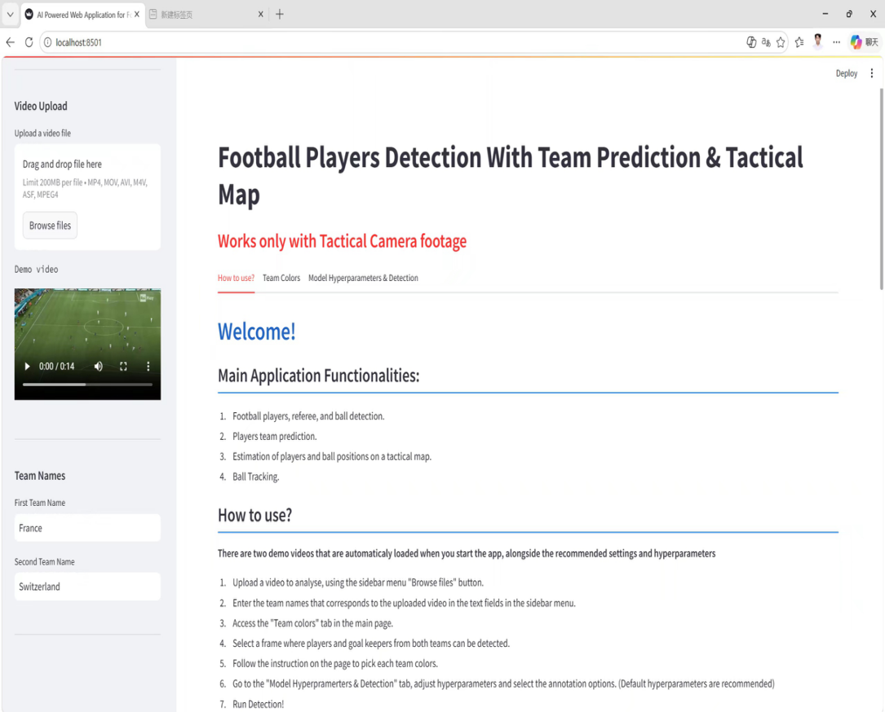

# Low-Cost Football Analytics

A low-cost football analytics project that uses deep learning and computer vision to extract useful insights from football match video. The repository focuses on making video-based football analysis more accessible with open-source Python tools such as PyTorch, Ultralytics, OpenCV, scikit-learn, and Streamlit.

## Overview

`low-cost-football-analytics` is intended for students, analysts, coaches, and football fans who want to experiment with practical football analytics without expensive tracking systems or commercial data subscriptions.

The current implementation is centered on tactical-camera footage and supports workflows such as:

- Detecting players, referees, and the ball
- Projecting detections onto a tactical map
- Predicting teams from jersey colors
- Visualizing ball tracks and player heatmaps
- Exploring simple interactive outputs with Streamlit

## Features

- Computer-vision based football video analysis
- Deep learning workflow using PyTorch and Ultralytics
- Video and image processing with OpenCV and Pillow
- Machine learning utilities with scikit-learn
- Streamlit support for interactive demos and dashboards
- Extensible structure for scouting, match review, and tactical analysis
- Experimental possession and passing statistics

## Demo Showcase

### 1. Application Home Page



### 2. Color Selection for Football Players' Clothing


### 3. Parameter Adjustment


### 4. Detection and Tactical Analysis Output


## Repository Layout

The main project code lives in:

`Football-Analytics-with-Deep-Learning-and-Computer-Vision-master/`

Key files:

- `Football-Analytics-with-Deep-Learning-and-Computer-Vision-master/Streamlit web app/main.py`: Streamlit app entry point
- `Football-Analytics-with-Deep-Learning-and-Computer-Vision-master/Streamlit web app/detection.py`: detection, tactical map, tracking, and statistics logic
- `Football-Analytics-with-Deep-Learning-and-Computer-Vision-master/models/`: trained YOLO model artifacts
- `Football-Analytics-with-Deep-Learning-and-Computer-Vision-master/Football Object Detection With Tactical Map.ipynb`: notebook prototype

## Getting Started

### Prerequisites

Recommended setup:

- Python 3.10 or newer
- Git
- A virtual environment
- A local football video file for testing

### Installation

Clone the repository:

```bash
git clone https://github.com/TIANjiming07/low-cost-football-analytics.git
cd low-cost-football-analytics
```

Move into the main project folder:

```bash
cd Football-Analytics-with-Deep-Learning-and-Computer-Vision-master
```

Create and activate a virtual environment:
```
Windows
```bash
python -m venv .venv
.venv\Scripts\activate
```
macOS / Linux
```bash
python3 -m venv .venv
source .venv/bin/activate
```

Install the dependencies:

```bash
pip install -r requirements.txt
```

> Note: The dependency file currently lists `python-opencv`. If installation fails, try installing `opencv-python` instead.


## Usage

A typical workflow is:

1. Add or reference a football match video.
2. Run the computer vision pipeline to detect and track objects.
3. Generate annotated video, metrics, or dashboard outputs.
4. Review the results and refine the analysis.

To run the current Streamlit app:

```bash
cd "Football-Analytics-with-Deep-Learning-and-Computer-Vision-master/Streamlit web app"
streamlit run main.py
```

If `streamlit` is not available in your shell, use:

```bash
python -m streamlit run main.py
```

The app is usually available at:

`http://localhost:8501`

## Potential Analysis Outputs

This project can support or be extended to support:

- Real-time tactical analysis with low-cost equipment
- Player team prediction
- Estimation of player and ball positions on a tactical map
- Ball tracking
- Heatmap visualization
- Possession rate analysis
- Team pass count statistics


